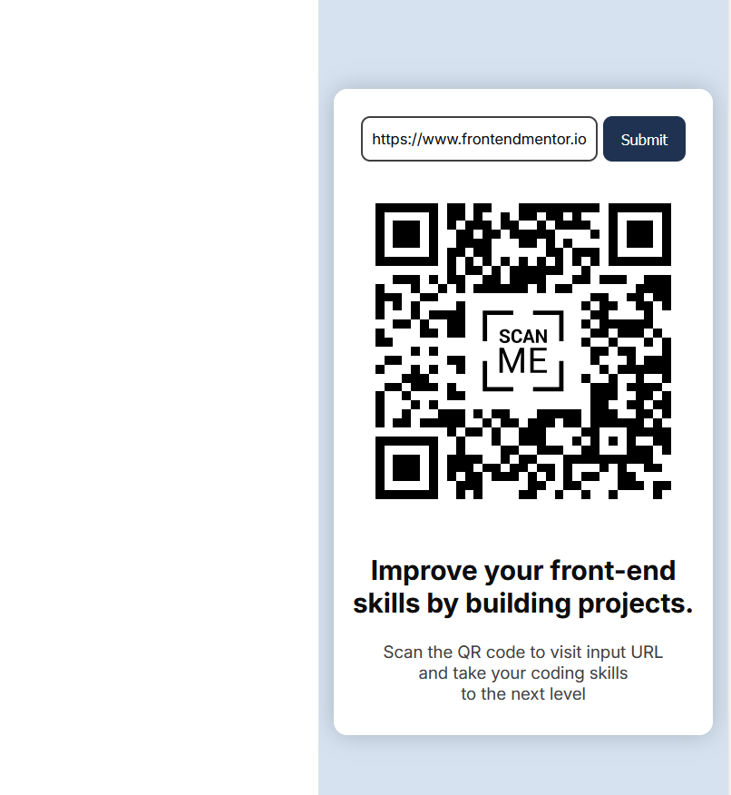
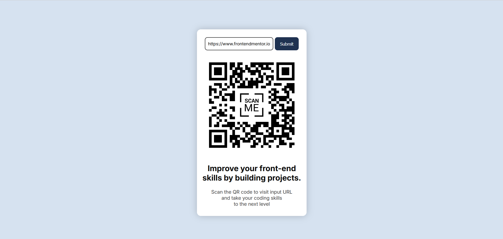

# QR Code Component Challenge

This folder contains the implementation for the **first challenge** from [Frontend Mentor](https://www.frontendmentor.io). The challenge involves building a QR code component that dynamically generates a QR code based on a provided URL.

## Technologies & Tools

- **Sass:**  
  Used for modular, maintainable styling.

- **PurgeCSS:**  
  Optimizes the final CSS file by removing unused styles.

- **Utility-First CSS Approach:**  
  The styling is built with a utility-first methodology, similar to that found in popular CSS frameworks.

- **HTML:**  
  Structures the layout and defines the necessary semantics.

- **JavaScript:**
  - **Axios:**  
    For making API calls.
  - **Toastify:**  
    For displaying notifications to the user.
  - **API Call:**  
    The QR code data is fetched from the [QR Code Generator API](https://www.qr-code-generator.com/).  
    **Note:** To test the program locally, you'll need to obtain an API key from the QR Code Generator website.
  - **Vite Proxy:**  
    Vite is configured with a proxy (in `vite.config.js`) to address CORS issues during local development.

- **Vercel & Github pages:**  
  For deploying back-end and front-end app.

## Demo

Below is a side-by-side preview of the component in both mobile and desktop views:

| Mobile Demo                                            | Desktop Demo                                             |
|--------------------------------------------------------|----------------------------------------------------------|
|         |         |
| *Mobile view of the QR Code component*                | *Desktop view of the QR Code component*                  |

You can visit the live version at [QR code generator app](https://ariarash44.github.io/frontend-mentor/1.QRcode/)
