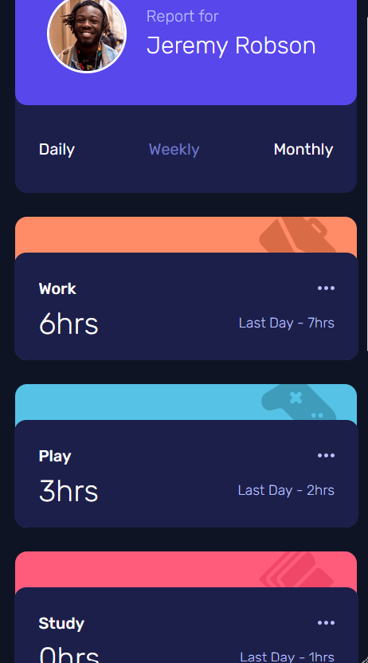
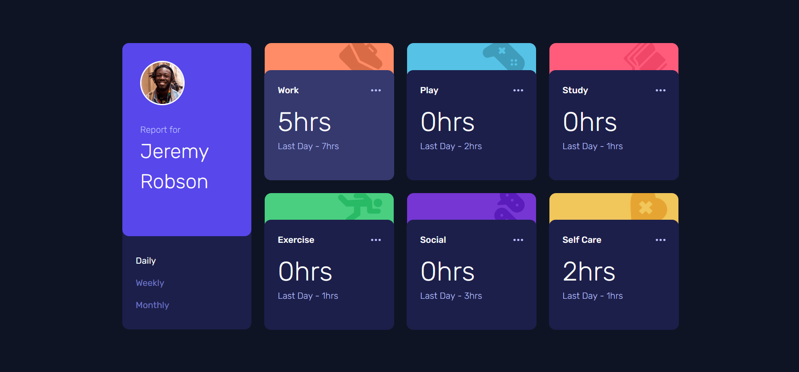

# Time Dashboard Challenge

This repository contains the implementation of the **Time Dashboard** project, inspired by [Frontend Mentor](https://www.frontendmentor.io). The challenge focuses on creating a time-tracking dashboard with dynamic updates.

## Technologies & Tools

### **Backend (Node.js & TypeScript)**
- **Node.js with TypeScript:**  
  Used to create a reliable, type-safe backend.
- **Webpack:**  
  Bundles and optimizes the application for efficient deployment.

### **Frontend (React & Styling)**
- **React:**  
  Handles the UI with reusable and interactive components.
- **Tailwind CSS:**  
  Primary styling framework for utility-first design.
- **Sass:**  
  Used sparingly for modular and maintainable styles.

### **Data Handling**
- **TypeScript & TSX:**  
  Ensures type safety for UI components and logic.
- **Axios & SWR:**  
  - SWR optimizes data fetching by and calls API every 10 seconds.
  - Axios provides API connectivity for server requests.

### **Notifications & Deployment**
- **Toastify:**  
  Provides user-friendly notifications for errors and updates.
- **Lodash:**  
  Utilized for throttling notifications to enhance performance.
- **Deployment:**  
  - **Vercel:** Back-end deployment for a smooth experience.
  - **GitHub Pages:** Front-end deployment for easy accessibility.

## Live Demo
Below is a side-by-side preview of the component in both mobile and desktop views:

| Mobile Demo                                            | Desktop Demo                                             |
|--------------------------------------------------------|----------------------------------------------------------|
|         |         |
| *Mobile view of the time tracking dashboard*                | *Desktop view of the time tracking dashboard*                  |

View the live version of the Time Dashboard here:  
🔗 [Time Dashboard Live](https://ariarash44.github.io/frontend-mentor/10.TTDashboard/)
