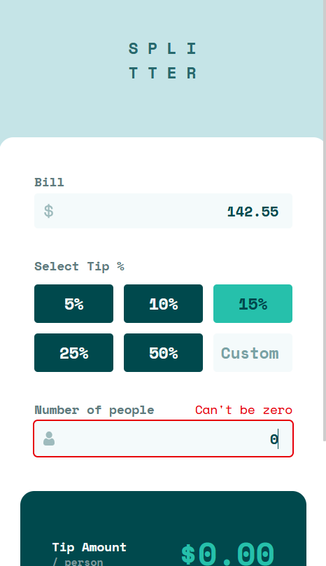
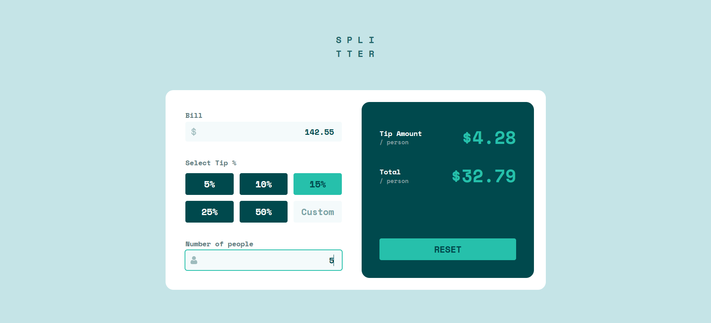

# Tip Calculator App

This folder contains the solution to the **Frontend Mentor Tip Calculator Challenge** from [Frontend Mentor](https://www.frontendmentor.io). This project leverages **React, TypeScript, Jest (TDD approach), Zustand, Tailwind CSS, and ShadCN** to create a responsive and functional UI.

## Technologies & Tools

- **React & TypeScript**: Enables modular, scalable development.
- **Jest (TDD approach)**: Ensures robust test-driven development.
- **Zustand**: Manages global state efficiently.
- **Tailwind CSS & ShadCN**: Simplifies UI design and styling.
- **GitHub Pages**: For deploying the front-end app.

## Demo

Below is a side-by-side preview of the component in both mobile and desktop views:

| Mobile Demo                                            | Desktop Demo                                             |
|--------------------------------------------------------|----------------------------------------------------------|
|         |         |
| *Mobile view of the Tip Calculator component*                | *Desktop view of the Tip Calculator component*                  |

You can visit the live version at [Tip Calculator App](https://ariarash44.github.io/frontend-mentor/11.tipCalculator/)
