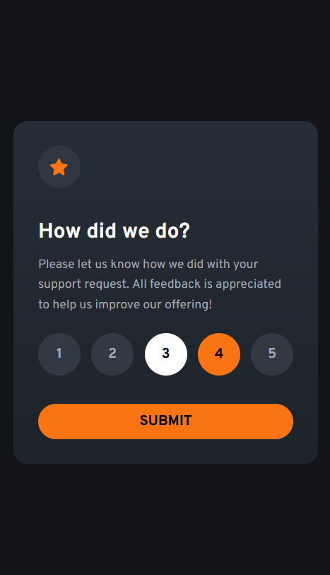
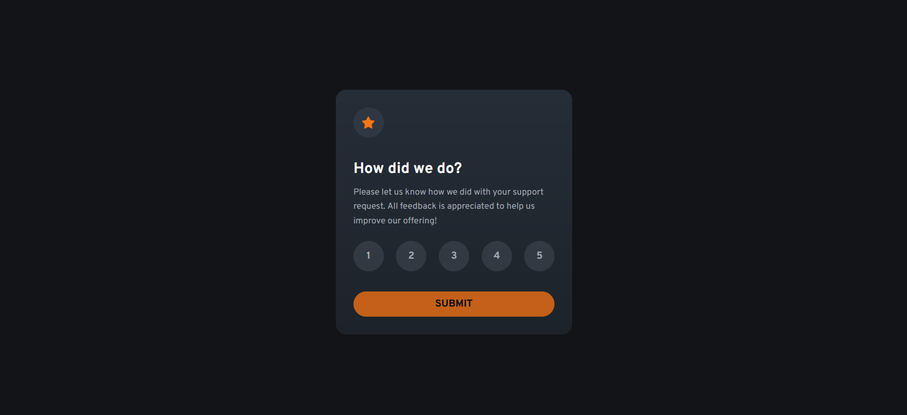

# Rating Component Challenge  

This folder contains the implementation for the **Rating Component** challenge from [Frontend Mentor](https://www.frontendmentor.io). The challenge involves building an interactive rating component that captures user input dynamically and provides an accessible experience.

## Technologies & Tools  

- **Next.js:**  
  Utilized for server-side rendering (SSR) to improve performance and SEO.

- **Tailwind CSS:**  
  Used for rapid styling with a utility-first approach.

- **Framer Motion:**  
  Implemented for smooth animations, enhancing the user experience during button hover and active states.

- **JavaScript:**  
  Manages dynamic interactions and logic.

- **Accessibility Best Practices:**  
  ARIA attributes and semantic HTML are used to ensure a better experience for all users.

- **Vercel:**  
  Deployed on Vercel for fast and efficient hosting.

## Demo  

Below is a side-by-side preview of the component in both mobile and desktop views:

| Mobile Demo                                            | Desktop Demo                                             |
|--------------------------------------------------------|----------------------------------------------------------|
|         |         |
| *Mobile view of the Rating Component*                 | *Desktop view of the Rating Component*                   |

You can visit the live version at [Rating Component](https://12-rating-component.vercel.app/)