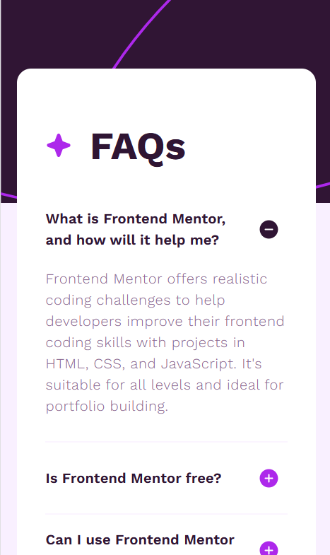
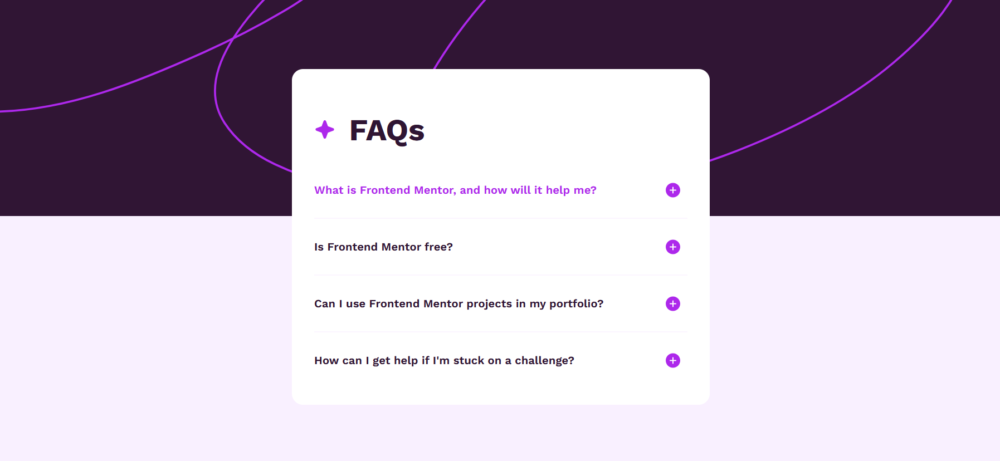

# FAQs Accordion Component Challenge

This repository contains the implementation for the **FAQs Accordion** challenge from [Frontend Mentor](https://www.frontendmentor.io). The project features a responsive, accessible accordion component built using Angular and custom-designed Material UI components.

## Technologies & Tools

### 🧩 Frontend

- **Angular (v19)**  
  Built with Angular’s latest capabilities, including DI pattern, control-flow syntax (`@if`, `@for`), and signal-based reactivity.

- **TypeScript**  
  Typed and modular component architecture.

- **Sass + PostCSS**  
  Modular styling optimized with PostCSS and PurgeCSS to remove unused CSS from Sass files.

- **Material UI (Custom)**  
  Accordion built with MUI and fully customized for clean design without mutating external libraries.

- **Toastify**  
  For user-friendly error handling and messaging.

- **Karma + Jasmine**  
  Unit tests for components and services ensure reliability and maintainability.

- **GitHub Pages**  
  Used for deploying the front-end to a live environment.

### 🔧 Backend

- **JavaScript + Express**  
  Lightweight Express API prepared for scalable backend logic.

- **Vercel**  
  Backend deployed to Vercel for seamless serverless hosting.

## Features

- Responsive design that adapts to mobile and desktop.
- Reusable and accessible accordion with keyboard navigation support.
- Signal-based state management for open/close logic.
- Style and layout tailored via Sass with utility-first design principles.
- Unit-tested service logic and component behavior.

## Demo

| Mobile Demo                                            | Desktop Demo                                             |
|--------------------------------------------------------|----------------------------------------------------------|
|           |           |
| *Mobile view of the FAQs accordion component*               | *Desktop view of the FAQs accordion component*                |

🔗 **Live Demo:** [FAQs Accordion App](https://ariarash44.github.io/frontend-mentor/13.qaAccordion/)
