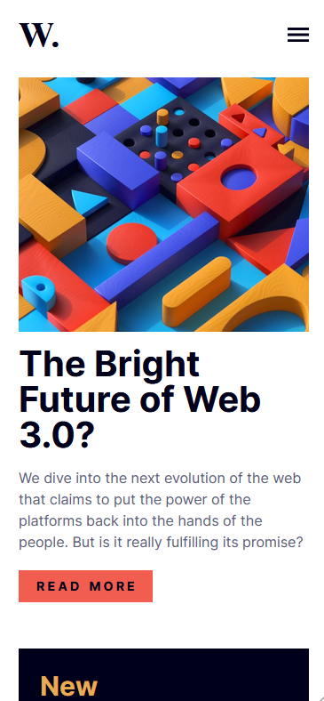
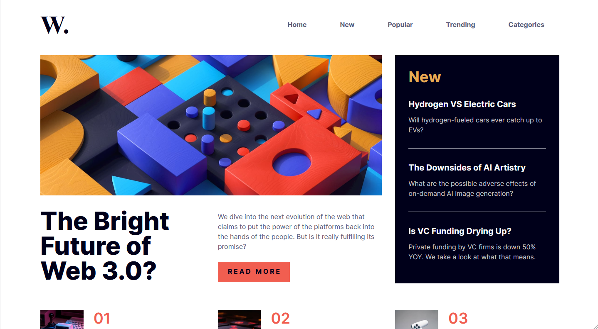

# News Home Page Challenge

This folder contains the implementation for the **fifteenth challenge** from [Frontend Mentor](https://www.frontendmentor.io).  
The challenge involves building a **responsive news homepage** with a focus on clean UI, accessibility, and smooth interactivity, using Nuxt with a static site generation approach.

## Technologies & Tools

- **Nuxt (SSG mode):**  
  Used to build a fast, SEO‑friendly static site, with the benefits of Vue's reactivity and Nuxt’s routing.

- **TypeScript:**  
  Ensures type safety and better development tooling.

- **Tailwind CSS:**  
  Utility‑first CSS framework for rapid styling and responsive design.

- **Animate.css:**  
  Adds subtle, performant animations to enhance user experience.

- **Accessibility‑Focused Development:**  
  Semantic HTML, proper ARIA attributes, and keyboard navigation support are implemented throughout.

- **GitHub Pages:**  
  Used for deploying the front‑end project via a static build.

## Demo

Below is a preview of the project in mobile and desktop layouts:

| Mobile Demo | Desktop Demo |
|-------------|--------------|
|  |  |
| *Mobile view of the news homepage* | *Desktop view of the news homepage* |

You can visit the live version here:  
[News Home Page – Live Site](https://ariarash44.github.io/frontend-mentor/15.newsHomePage/)