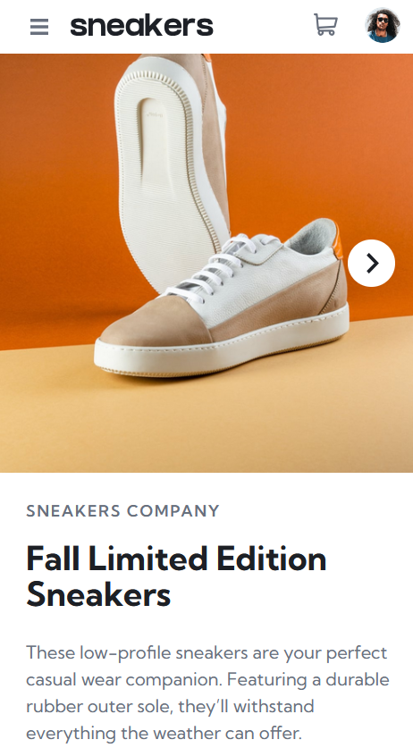
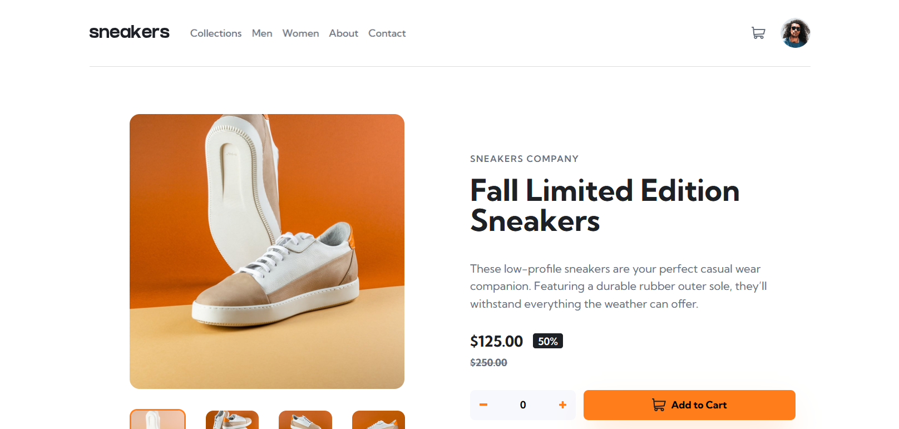

# E-commerce Product Page Challenge

The challenge involves building a responsive e-commerce product page with a focus on clean UI, accessibility, and interactive shopping features, using SvelteKit with a static site generation approach.

This folder contains the implementation for the **sixteenth challenge** from [Frontend Mentor](https://www.frontendmentor.io).  
The challenge involves building a responsive e-commerce product page with a focus on clean UI, accessibility, and interactive shopping features, using SvelteKit with a static site generation approach.

## Technologies & Tools

- **SvelteKit (Static build):**  
  Used to build a fast, SEO-friendly static site with Svelte's reactivity and SvelteKit's routing capabilities.

- **TypeScript:**  
  Ensures type safety and better development experience.

- **Tailwind CSS:**  
  Utility‑first CSS framework for rapid styling and responsive design.

- **Accessibility‑Focused Development:**  
  Semantic HTML, proper ARIA attributes, and keyboard navigation support are implemented throughout.

- **GitHub Pages:**  
  Used for deploying the project via a static build.

## Demo

Below is a preview of the project in mobile and desktop layouts:

| Mobile Demo | Desktop Demo |
|-------------|--------------|
|  |  |
| *Mobile view of the e-commerce product page* | *Desktop view of the e-commerce product page* |

You can visit the live version here:  
[ e-commerce product page – Live Site](https://ariarash44.github.io/frontend-mentor/16.eProductPage/)