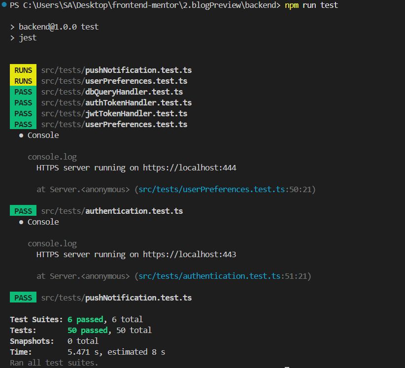
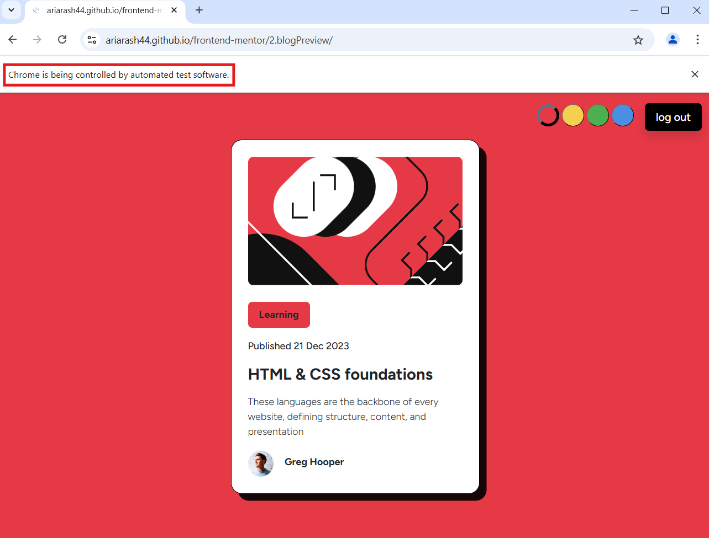
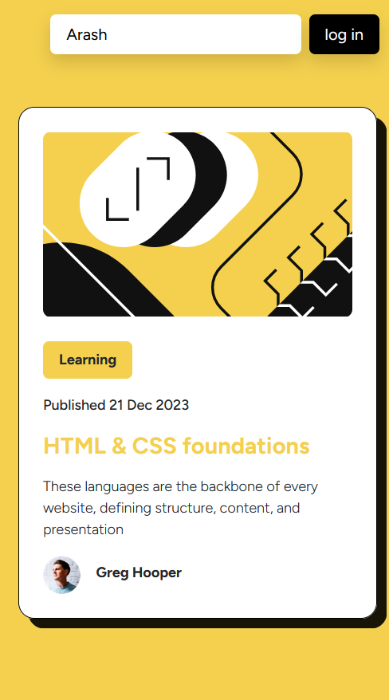
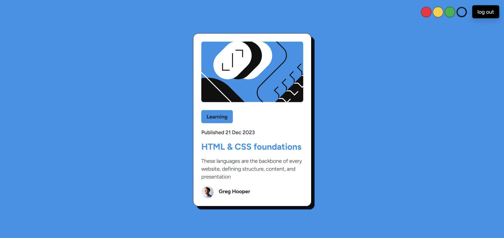

# Blog Preview Component Challenge

This folder contains the implementation for the **second challenge** from [Frontend Mentor](https://www.frontendmentor.io). The challenge involves building a blog preview component that includes dynamic theme selection and a login feature. Users can log in by simply providing their username (as the project is for learning purposes) and choose their preferred themes dynamically. Additionally, users can log in with the same username across multiple devices and see changes made on one device reflected live on others using the WebSocket protocol.
> **Note:** Since the back-end is deployed on Glitch, and Glitch has some limitations for the free plan, it may occasionally be slow.

## Technologies & Tools

- **HTML, CSS & Bootstrap:**  
  Used for building the structure, styling, and responsive design of the project.

- **TypeScript:**  
  Ensures type safety, making the codebase more robust and maintainable.

- **REST API & Axios:**  
  - **Axios:**  
    Facilitates seamless API communication.  
  - **REST API:**  
    Enables interaction with the back-end services.

- **WebSocket & WS:**  
  Implements real-time communication between clients and the server.

- **Cookies for Authentication:**  
  Used for securely storing user authentication details.  
  > **Note:** Previously, I relied on local storage for this purpose. During this project, I learned that cookies are a more secure and efficient method for handling authentication, particularly because they can be sent automatically with requests and allow for better server-side validation.

- **HTTPS and Keys for Sending Cookies:**  
  Ensures secure transmission of sensitive information.  
  >**Note:** To test this locally, you'll need to set up HTTPS in your development environment and add your private key.

- **MySQL:**  
  Handles the storage and management of structured data for the project.

- **Deployment Tools:**  
  - **Glitch:**  
    Used for deploying the back-end.  
  - **GitHub Pages (GH Pages):**  
    Hosts the front-end application.
  - **Filess:**  
    Hosts the Database.

- **Testing Tools:**  
  - **Jest:**  
    Used for testing back-end routes to ensure they function as expected.  
  - **Selenium:**  
    Facilitates automated UI testing of the front end, improving reliability and user experience.

- **Code Quality & Notifications:**  
  - **Prettier:**  
    Formats the code consistently for better readability.  
  - **Toastify:**  
    Provides elegant notifications to inform the user about system events.

## Test Results

Below is a side-by-side result of tests for back-end and front-end apps:

| back-end test                                            | front-end test                                            |
|--------------------------------------------------------|----------------------------------------------------------|
|         |         |
| *Back-end tests using jest and supertest for routes*                | *Front-end tests using selenium for UI*                  |

## Demo

Below is a side-by-side preview of the component in both mobile and desktop views:

| Mobile Demo                                            | Desktop Demo                                             |
|--------------------------------------------------------|----------------------------------------------------------|
|         |         |
| *Mobile view of the blog preview component*                | *Desktop view of the blog preview component*                  |

You can visit the live version at [blog preview app](https://ariarash44.github.io/frontend-mentor/2.blogPreview/)
