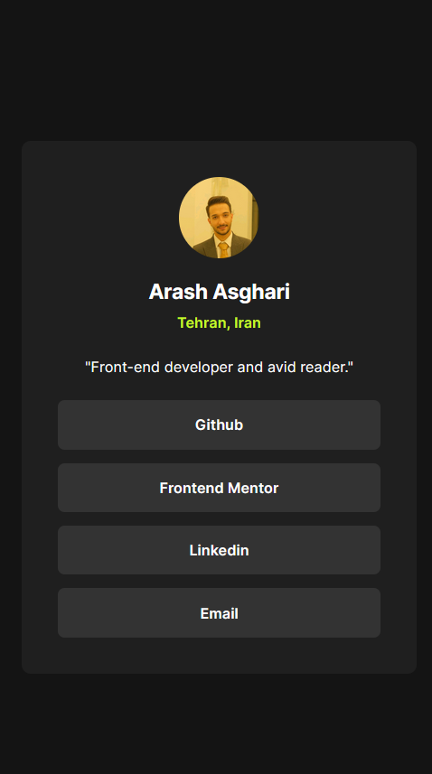
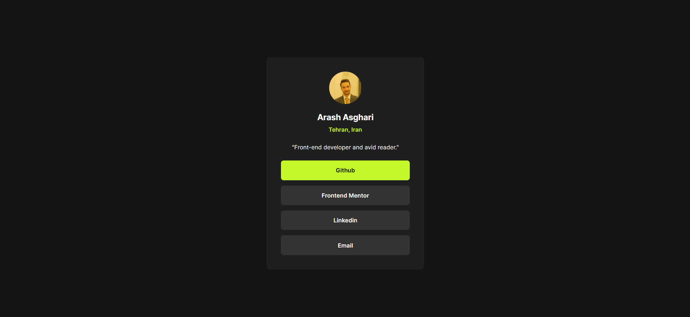

# Social Links Profile Challenge

This folder contains the implementation for the **third challenge** from [Frontend Mentor](https://www.frontendmentor.io). The challenge involves building a social links profile page that aggregates your various social media profiles and enables navigating into them.

## Technologies & Tools

- **HTML:**  
  Structures the layout and defines the necessary semantics.

- **CSS & Tailwind CSS:**  
  Employed for styling. Nearly all styling is done using Tailwind, supporting a utility-first approach for rapid and responsive design.

- **JavaScript:**  
  Powers the dynamic behavior and interactivity of the page.

- **jQuery:**  
  Facilitates keyboard interactions such as key-up and key-down switching between buttons, enhancing the user experience.

- **GraphQL & Node.js:**  
  Supports server-side functionalities and API interactions, offering a modern approach to data handling.

- **Regex:**  
  Utilized for pattern matching and validating inputs as needed.

## Demo

Below is a side-by-side preview of the profile page in both mobile and desktop views:

| Mobile Demo                                             | Desktop Demo                                               |
| ------------------------------------------------------- | ---------------------------------------------------------- |
|    |     |
| *Mobile view of the Social Links Profile component*     | *Desktop view of the Social Links Profile component*        |

You can also view the live version at [Social Links Profile](https://ariarash44.github.io/frontend-mentor/3.socialProfiles/).
