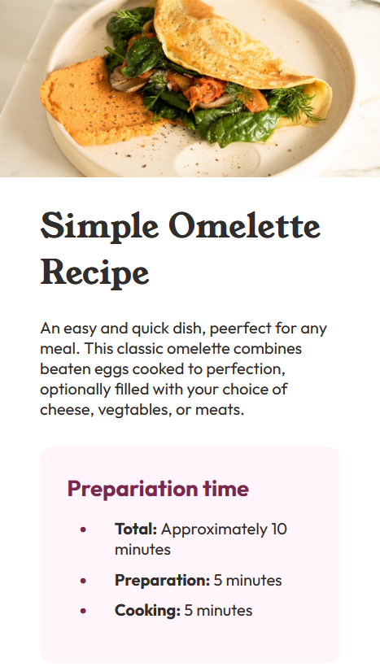
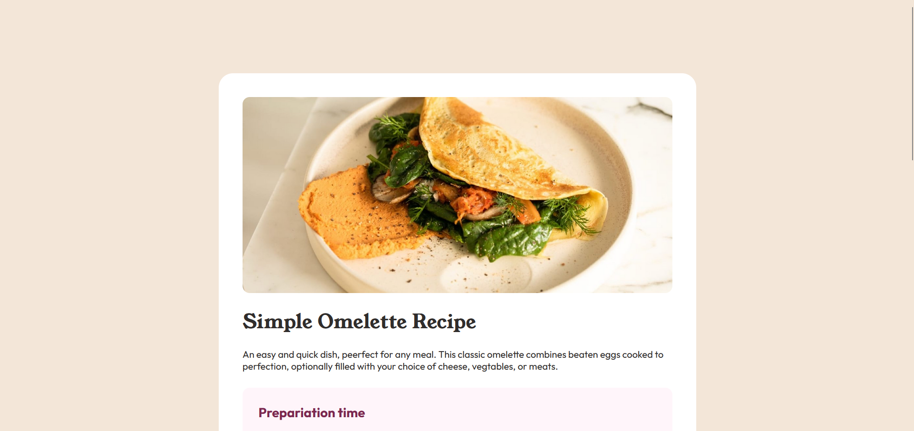

# Recipe Page Project

This repository contains the implementation for **recipe page project** from [Frontend Mentor](https://www.frontendmentor.io), designed using a component-based architecture. The project dynamically fetches and displays recipe details from mocking tools, while ensuring modular styling and a structured layout.

## Technologies & Tools

### **Styling & Component Design**
- **Less:**  
  Used for modular, maintainable styling with component-based methodology.

### **Core Technologies**
- **HTML:**  
  Provides the structure and semantic foundation for the project.
- **JavaScript:**  
  Manages dynamically renders components.

### **Component Rendering**
- **Lit-HTML:**  
  Used to efficiently insert and update HTML components.

### **Mock API & Backend Simulation**
- **MSW (Mock Service Worker):**  
  Simulates backend API responses, enabling local development without an actual API.

### **Code Quality & Optimization**
- **ESLint:**  
  Ensures clean and maintainable JavaScript code through linting.
- **Webpack:**  
  Handles bundling, optimizing assets, and managing dependencies for efficient performance.

## **Demo**

Below is a side-by-side preview of the project in both mobile and desktop views:

| Mobile Demo                                            | Desktop Demo                                             |
|--------------------------------------------------------|----------------------------------------------------------|
|  |  |
| *Mobile view of the recipe page*                      | *Desktop view of the recipe page*                        |

You can view the live version at: [Recipe Page App](https://ariarash44.github.io/frontend-mentor/4.recipePage/)
