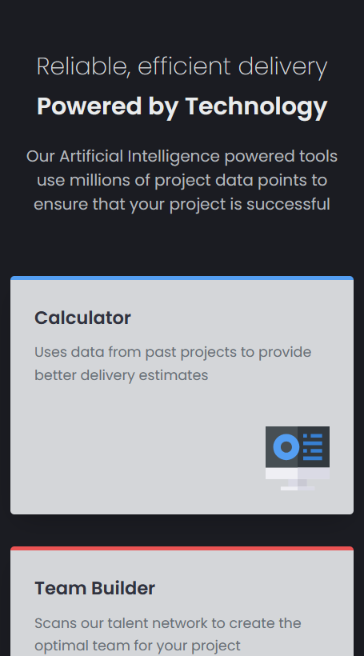
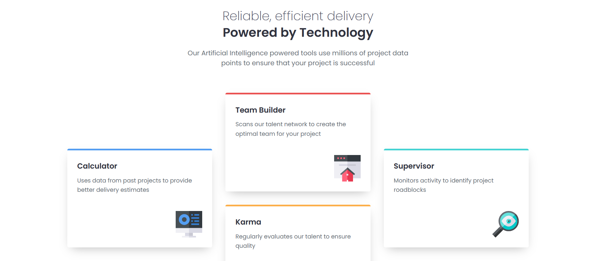

# Four Card Feature Challenge

This folder contains the implementation for the **themeable four-card page challenge** from [Frontend Mentor](https://www.frontendmentor.io). The challenge involves creating an interactive four-card layout where users can drag and swap cards dynamically.

## Technologies & Tools

- **React:**  
  Used for building a scalable and efficient component structure.

- **Tailwind CSS:**  
  Enables utility-first styling and provides an easy way to implement a **dark theme**.

- **React DND:**  
  Used for enabling **drag-and-drop** functionality to rearrange cards effortlessly.

- **Framer Motion:**  
  Provides smooth and aesthetic **animations** when swapping cards.

- **Toastify:**  
  Displays **notifications** informing users of the updated card order.

- **JavaScript & HTML:**  
  Essential for structuring the page and adding interactive behavior.

- **Sass:**  
  Used for defining global styles and maintaining modular, reusable styling.

## Demo

Below is a side-by-side preview of the component in both mobile and desktop views:

| Mobile Demo                                            | Desktop Demo                                             |
|--------------------------------------------------------|----------------------------------------------------------|
|         |         |
| *Mobile view of the four-card component*              | *Desktop view of the four-card component*                |

You can visit the live version at [Four Card Feature Challenge](https://ariarash44.github.io/frontend-mentor/6.fourCard/)
