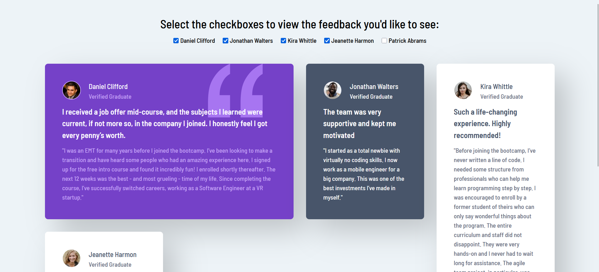

# Testimonials Grid Component Challenge

This folder contains the implementation for the **Testimonials Grid Component challenge** from [Frontend Mentor](https://www.frontendmentor.io). The challenge involves building a responsive grid-based layout that showcases user testimonials.

## Technologies & Tools

- **TypeScript:**  
  Provides static typing and enhances code maintainability.

- **React:**  
  Used for creating reusable and efficient UI components.

- **Framer Motion:**  
  Adds smooth animations and transitions to enhance user experience, here used for fading effect.

- **Tailwind CSS:**  
  A utility-first CSS framework for responsive and customizable styling.

- **GitHub Pages:**  
  Used for deploying the applications.

## Demo

Below is a preview of the testimonials grid component in both mobile and desktop views:

| Mobile Demo                                            | Desktop Demo                                             |
|--------------------------------------------------------|----------------------------------------------------------|
|         |         |
| *Mobile view of the testimonials grid component*       | *Desktop view of the testimonials grid component*        |

You can visit the live version at [Testimonials Grid Component](https://ariarash44.github.io/frontend-mentor/7.testimonialsGrid/).
