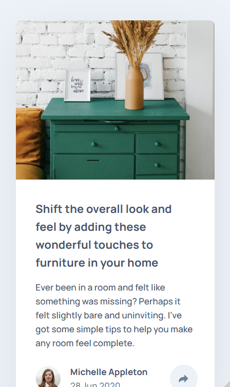

# Article Preview Challenge

This folder contains the solution to the **Frontend Mentor Article Preview Challenge** from [Frontend Mentor](https://www.frontendmentor.io).  This project leverages **React, TypeScript, MUI, Tailwind, and Redux** to create a responsive and functional UI.

## Technologies & Tools

- **React & TypeScript**: Enables modular, scalable development.
- **MUI & Tailwind CSS**: Simplifies UI design and styling.
- **Redux Toolkit**: Manages global state efficiently.
- **Github pages:**  For deploying back-end and front-end app.

## Demo

Below is a side-by-side preview of the component in both mobile and desktop views:

| Mobile Demo                                            | Desktop Demo                                             |
|--------------------------------------------------------|----------------------------------------------------------|
|         |         |
| *Mobile view of the Article Preview component*                | *Desktop view of the Article Preview component*                  |

You can visit the live version at [Article Preview app](https://ariarash44.github.io/frontend-mentor/8.articlePreview/)
